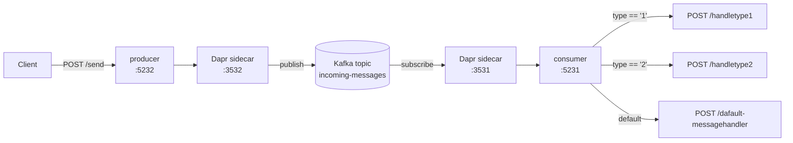

[](https://github.com/AndriyKalashnykov/dapr-dotnet-pub-sub/actions/workflows/ci.yml)
[](https://hits.sh/github.com/AndriyKalashnykov/dapr-dotnet-pub-sub/)
[](https://opensource.org/licenses/MIT)
[](https://app.renovatebot.com/dashboard#github/AndriyKalashnykov/dapr-dotnet-pub-sub)

# Dapr DotNet pub/sub

Dapr publish-subscribe demo with two .NET 10 microservices communicating via Kafka through the Dapr sidecar. The **producer** publishes `TinyMessage` events to a Kafka topic; the **consumer** receives them via Dapr's declarative subscription with content-based routing.

Visit the [Dapr Pub/Sub documentation](https://docs.dapr.io/developing-applications/building-blocks/pubsub/) for more information.

## Tech Stack

| Component | Technology |
|-----------|------------|
| Language | .NET 10 (pinned via `global.json` → `10.0.201`, `rollForward: latestFeature`) |
| Framework | ASP.NET Core Web API |
| Pub/Sub | [Dapr](https://dapr.io/) 1.17.8 (`Dapr.AspNetCore`) |
| Message Broker | Apache Kafka (KRaft mode, Confluent images) |
| Testing | [TUnit](https://tunit.dev/) 1.30.8 + `Microsoft.AspNetCore.Mvc.Testing` 10.0.5 |
| Mocking | [FakeItEasy](https://fakeiteasy.github.io/) 9.0.1 |
| Infrastructure | Docker Compose (Kafka + Kafka UI) |
| CI/CD | GitHub Actions |
| Dependencies | [Renovate](https://docs.renovatebot.com/) with platform automerge |
| Static Analysis | `dotnet format`, Trivy (fs, vuln, secret, misconfig), gitleaks, mermaid-cli (diagram lint) |

## Architecture



## Quick Start

In one terminal, start the Kafka infrastructure (blocks):

```bash
make kafka-start  # Kafka on :9092, Kafka UI on :9080
```

In a second terminal, build and run the apps:

```bash
make deps            # verify .NET SDK is installed
make build           # restore and build the solution
make test            # run unit tests (TUnit)
make e2e             # run end-to-end tests (WebApplicationFactory)
make coverage-check  # run all tests and enforce 80% line coverage
make run             # start producer (:5232) + consumer (:5231) via Dapr
make post            # send test messages to the producer
```

## Prerequisites

| Tool | Version | Purpose |
|------|---------|---------|
| [GNU Make](https://www.gnu.org/software/make/) | 3.81+ | Build orchestration |
| [Git](https://git-scm.com/) | 2.0+ | Version control |
| [.NET SDK](https://dotnet.microsoft.com/download) | 10.0+ | Build and run .NET projects (pinned via `global.json`) |
| [Docker](https://www.docker.com/) | 20.10+ | Run Kafka, Trivy, and gitleaks |
| [Dapr CLI](https://docs.dapr.io/getting-started/install-dapr-cli/) | 1.17.1+ | Sidecar-based pub/sub (run `make dapr-init` once to install the pinned runtime) |
| [act](https://github.com/nektos/act) | 0.2.87+ | Run GitHub Actions locally (used by `make ci-run`) |
| [curl](https://curl.se/) | any | Send HTTP requests to APIs |

Verify the .NET SDK is installed:

```bash
make deps
```

For full runtime verification (docker, dapr), use `make deps-run`.

## Available Make Targets

Run `make help` to see all available targets.

### Build & Run

| Target | Description |
|--------|-------------|
| `make build` | Restore and build entire solution |
| `make test` | Run unit tests (TinyMessageDto only) |
| `make e2e` | Run end-to-end tests (Producer/Consumer via WebApplicationFactory) |
| `make coverage-check` | Run all tests with coverage and enforce 80% line threshold |
| `make clean` | Remove build artifacts |
| `make run` | Build, stop previous, and run both apps via Dapr |
| `make post` | Send test messages to producer (requires `make run`) |
| `make update` | Update NuGet packages to latest versions |

### Code Quality

| Target | Description |
|--------|-------------|
| `make format` | Auto-fix code formatting |
| `make lint` | Check code style and compiler warnings |
| `make vulncheck` | Check for vulnerable NuGet packages |
| `make trivy-fs` | Trivy filesystem scan (vuln, secret, misconfig) |
| `make secrets` | Scan for committed secrets with gitleaks |
| `make mermaid-lint` | Validate Mermaid diagrams in markdown files |
| `make deps-prune` | Show redundant NuGet package references |
| `make deps-prune-check` | Verify no redundant NuGet package references |
| `make static-check` | Composite quality gate (lint + vulncheck + trivy-fs + secrets + mermaid-lint + deps-prune-check) |

### Dapr & Kafka

| Target | Description |
|--------|-------------|
| `make kafka-start` | Start Kafka stack (KRaft mode, foreground) |
| `make kafka-stop` | Stop Kafka stack and remove volumes |
| `make stop` | Stop Dapr and kill processes on known ports |
| `make stop-dapr` | Stop Dapr multi-app run |
| `make stop-apps` | Kill processes on known ports (usage: `make stop-apps PORTS="5231 5232 ..."`) |

### CI

| Target | Description |
|--------|-------------|
| `make ci` | Run full CI pipeline (static-check, build, test, e2e, coverage-check) |
| `make ci-run` | Run GitHub Actions workflow locally via [act](https://github.com/nektos/act) (requires Docker) |
| `make dapr-init` | Install the pinned Dapr runtime version (idempotent) |

### Utilities

| Target | Description |
|--------|-------------|
| `make help` | List available tasks |
| `make deps` | Check required tool dependencies (dotnet, curl) |
| `make deps-docker` | Check Docker is installed (for containerised scanners) |
| `make deps-run` | Check runtime dependencies (dotnet, curl, docker, dapr) |
| `make deps-act` | Install act for local CI (to `~/.local/bin`) |
| `make release VERSION=vX.Y.Z` | Create a semver-validated release tag |
| `make renovate-bootstrap` | Install nvm and Node for Renovate |
| `make renovate-validate` | Validate Renovate configuration |

## Architecture Details

### Projects

Four projects in `dapr-dotnet-pub-sub.slnx`:

- **common/** — Shared library. Contains `TinyMessage` record and `TinyMessageDto` with parsing/validation logic.
- **producer/** — ASP.NET Web API. Exposes `POST /send` (JSON publish) and `POST /sendasbytes` (byte publish). Uses `DaprClient.PublishEventAsync` to publish to the `message-pubsub-kafka` component on topic `incoming-messages`.
- **consumer/** — ASP.NET Web API. Receives messages via Dapr subscription. Uses `CloudEvents` middleware and MVC controllers for subscription endpoint mapping.
- **tests/** — TUnit test project. References common, producer, and consumer. Uses FakeItEasy for mocking and `Microsoft.AspNetCore.Mvc.Testing` for web API testing.

### Message Routing (declarative subscription)

Defined in `components/subscription.yaml` using Dapr v2alpha1 Subscription spec:

| Condition | Route |
|-----------|-------|
| `type == "1"` | `POST /handletype1` |
| `type == "2"` | `POST /handletype2` |
| default | `POST /dafault-messagehandler` (intentional typo) |

### Dapr Components

All components live in `components/`:

- `kafka.yaml` — Kafka pubsub component (`message-pubsub-kafka`), broker at `localhost:9092`, scoped to producer + consumer
- `subscription.yaml` — Declarative subscription with content-based routing rules
- `dapr.yaml` — Dapr configuration (tracing, metrics)

The root-level `dapr.yaml` (not in `components/`) is the multi-app run template used by `dapr run -f .`.

### Port Assignments

| Service  | App Port | Dapr Sidecar Port |
|----------|----------|-------------------|
| producer | 5232     | 3532              |
| consumer | 5231     | 3531              |

### Infrastructure

`docker-compose-kafka.yml` runs Kafka in KRaft mode (no Zookeeper):

| Service  | Port | Purpose |
|----------|------|---------|
| Kafka    | 9092 | Message broker |
| Kafka UI | 9080 | Web UI at <http://localhost:9080> |

## CI/CD

GitHub Actions runs on every push to `main`, tag `v*`, and pull request. The pipeline uses a composite quality gate that bundles all static checks into a single `make static-check` step: format verification, warnings-as-errors build, vulnerability scan, Trivy filesystem scan (vuln + secret + misconfig), gitleaks secrets scan, Mermaid diagram lint, and redundant package check.

| Job | Triggers | Steps |
|-----|----------|-------|
| **static-check** | push, PR, tags | `make static-check` (composite quality gate) |
| **build** | after static-check | `make build` |
| **test** | after static-check | `make test` (unit tests) |
| **e2e** | after build + test | `make e2e` (WebApplicationFactory endpoint tests) |
| **coverage** | after build + test | `make coverage-check` (80% line threshold) + upload cobertura report |
| **ci-pass** | always, after all jobs | Gate job that fails if any upstream job failed or was cancelled (single branch-protection check) |

`build` and `test` run in parallel after `static-check` passes; `e2e` and `coverage` run in parallel after both. `ci-pass` gates on the full set so branch protection only needs to track a single check.

A second workflow, `cleanup-runs.yml`, runs weekly on Sundays to delete workflow runs older than 7 days and to prune GitHub Actions caches from deleted/merged branches.

### Required Secrets and Variables

No user-defined secrets or variables are required — workflows use only the built-in `GITHUB_TOKEN` provided automatically to every GitHub Actions run.

### Dependency Updates

[Renovate](https://docs.renovatebot.com/) keeps dependencies up to date with `platformAutomerge` enabled. It groups GitHub Actions, TUnit, Dapr SDK, and Docker Compose image updates into single PRs, and uses a custom regex manager to update Makefile tool version constants (`TRIVY_VERSION`, `GITLEAKS_VERSION`, `ACT_VERSION`, `NVM_VERSION`, `DAPR_CLI_VERSION`) via inline `# renovate:` comments.

## Run all apps with multi-app run template file

This section shows how to run both applications at once using [multi-app run template files](https://docs.dapr.io/developing-applications/local-development/multi-app-dapr-run/multi-app-overview/) with `dapr run -f .`.

1. Open a new terminal and run Kafka:

```bash
make kafka-start
```

2. Open a new terminal and run consumer and producer:

```bash
make run
```

3. Send a message to the producer:

```bash
curl -X POST http://localhost:5232/send \
  -H "Content-Type: application/json" \
  -d '{"id": "a1cdd036-c529-4bf9-bd59-d7148ef9237d", "timeStamp": "2025-09-26T02:52:04.835Z", "type": "2"}'
```

Example output (abbreviated):

```text
== APP - producer == Request starting HTTP/1.1 POST /send
== APP - producer == Sent message a1cdd036-..., timestamp: 9/26/2025 2:52:04 AM +00:00
== APP - producer == Setting HTTP status code 202.
== APP - consumer == Request received: POST /handletype2
== APP - consumer == Received message a1cdd036-..., timestamp: 9/26/2025 2:52:04 AM +00:00
```

4. Stop and clean up application processes and Kafka:

```bash
make stop
make kafka-stop
```

## Run a single app at a time with Dapr (Optional)

An alternative to running all applications at once is to run single apps one-at-a-time using multiple `dapr run ... -- dotnet run` commands.

### Run Dotnet message subscriber with Dapr

```bash
cd ./consumer
dapr run --app-id consumer --app-port 5231 --resources-path ../components dotnet run
```

### Run Dotnet message publisher with Dapr

```bash
cd ./producer
dapr run --app-id producer --app-port 5232 --resources-path ../components dotnet run
```

Stop and clean up:

```bash
dapr stop --app-id consumer
dapr stop --app-id producer
```
