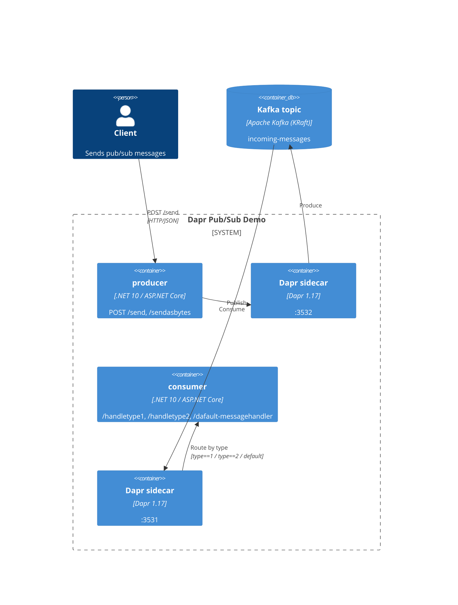

[](https://github.com/AndriyKalashnykov/dapr-dotnet-pub-sub/actions/workflows/ci.yml)
[](https://hits.sh/github.com/AndriyKalashnykov/dapr-dotnet-pub-sub/)
[](https://opensource.org/licenses/MIT)
[](https://app.renovatebot.com/dashboard#github/AndriyKalashnykov/dapr-dotnet-pub-sub)

# Dapr Pub/Sub on .NET 10 — Reference Service

The **runtime surface** exposes a producer (`POST /send`, `POST /sendasbytes`) and consumer (content-based subscription routing on the `type` field) ASP.NET Core API pair wired through Dapr sidecars to Apache Kafka, with OpenTelemetry traces exported to a Jaeger v2 backend (OTLP gRPC). The **delivery surface** covers a TUnit + FakeItEasy unit/integration suite over `WebApplicationFactory<Program>` with an 80% line-coverage threshold, a Compose-based real-sidecar e2e (`make e2e`), a KinD-based K8s e2e (`make kind-up && make e2e-kind`), and a GitHub Actions pipeline (`dotnet format` verify, `dotnet list package --vulnerable`, Trivy filesystem + image scan, gitleaks, Mermaid lint, SPDX license-check, cosign keyless OIDC image signing) on a `global.json`-pinned .NET 10 toolchain with Renovate-managed dependencies.



Visit the [Dapr Pub/Sub documentation](https://docs.dapr.io/developing-applications/building-blocks/pubsub/) for more information.

## Tech Stack

| Component | Technology |
|-----------|------------|
| Language | .NET 10 (pinned via `global.json` → `10.0.201`, `rollForward: latestFeature`) |
| Framework | ASP.NET Core Web API |
| Pub/Sub | [Dapr](https://dapr.io/) 1.17.8 (`Dapr.AspNetCore`) |
| Message Broker | Apache Kafka (KRaft mode, Confluent images) |
| Testing | [TUnit](https://tunit.dev/) 1.31.0 + `Microsoft.AspNetCore.Mvc.Testing` 10.0.5 |
| Mocking | [FakeItEasy](https://fakeiteasy.github.io/) 9.0.1 |
| Infrastructure | Docker Compose (Kafka + Kafka UI + Jaeger v2) |
| Observability | OpenTelemetry → [Jaeger v2](https://www.jaegertracing.io/) (OTLP gRPC, all-in-one) |
| Tool management | [mise](https://mise.jdx.dev/) (Node, Dapr CLI, act, kind, kubectl, helm, cloud-provider-kind, cosign per `.mise.toml`) |
| CI/CD | GitHub Actions with cosign keyless OIDC image signing |
| Dependencies | [Renovate](https://docs.renovatebot.com/) with platform automerge |
| Static Analysis | `dotnet format`, Trivy (fs + image, vuln/secret/misconfig), gitleaks, mermaid-cli, SPDX license-check |

## Quick Start

In one terminal, start the Kafka infrastructure (blocks):

```bash
make kafka-start  # Kafka on :9092, Kafka UI on :9080
```

In a second terminal, build and run the apps:

```bash
make deps      # verify .NET SDK is installed
make build     # restore and build the solution
make run       # start producer (:5232) + consumer (:5231) via Dapr
make post      # send test messages to the producer
```

To run the test pyramid: `make test` (unit, seconds), `make integration-test` (in-process API, seconds), `make e2e` (real Dapr + Kafka, minutes), `make coverage-check` (full suite + 80% threshold).

## Prerequisites

| Tool | Version | Purpose |
|------|---------|---------|
| [GNU Make](https://www.gnu.org/software/make/) | 3.81+ | Build orchestration |
| [Git](https://git-scm.com/) | 2.0+ | Version control |
| [.NET SDK](https://dotnet.microsoft.com/download) | 10.0+ | Build and run .NET projects (pinned via `global.json`) |
| [Docker](https://www.docker.com/) | 20.10+ | Run Kafka, Trivy, and gitleaks |
| [mise](https://mise.jdx.dev/) | any | Installs the Dapr CLI, act, and Node pinned in `.mise.toml` (`make deps-tools`) |
| [curl](https://curl.se/) | any | Send HTTP requests to APIs |

Verify the .NET SDK is installed:

```bash
make deps
```

For full runtime verification (docker, mise-managed dapr CLI), use `make deps-run`. Run `make dapr-init` once to install the pinned Dapr runtime.

## Architecture

### Projects

Four projects in `dapr-dotnet-pub-sub.slnx`:

- **common/** — Shared library. Contains `TinyMessage` record and `TinyMessageDto` with parsing/validation logic.
- **producer/** — ASP.NET Web API. Exposes `POST /send` (JSON publish) and `POST /sendasbytes` (byte publish). Uses `DaprClient.PublishEventAsync` to publish to the `message-pubsub-kafka` component on topic `incoming-messages`.
- **consumer/** — ASP.NET Web API. Receives messages via Dapr subscription. Uses `CloudEvents` middleware and MVC controllers for subscription endpoint mapping.
- **tests/** — TUnit test project. References common, producer, and consumer. Uses FakeItEasy for mocking and `Microsoft.AspNetCore.Mvc.Testing` for web API testing. Includes error-path tests verifying DaprClient failure handling.

E2E orchestration lives outside the solution:

- **scripts/** — `e2e-compose.sh` brings up `compose/docker-compose.yml` (Kafka + Dapr sidecars + producer/consumer images) and asserts subscription routing via consumer-container log polling. `kind-up.sh` / `kind-down.sh` / `e2e-kind.sh` do the K8s equivalent against a KinD cluster with cloud-provider-kind for LoadBalancer support.

### Message Routing (declarative subscription)

Defined in `components/subscription.yaml` using Dapr v2alpha1 Subscription spec:

| Condition | Route |
|-----------|-------|
| `type == "1"` | `POST /handletype1` |
| `type == "2"` | `POST /handletype2` |
| default | `POST /dafault-messagehandler` (intentional typo) |

### Dapr Components

Three component sets, one per deployment flow:

| Flow | Path | Broker address |
|------|------|----------------|
| Local Dapr CLI (`make run`) | `components/kafka.yaml` + `components/subscription.yaml` | `localhost:9092` |
| Compose-based e2e (`make e2e`) | `compose/components/pubsub.yaml` + `compose/components/subscription.yaml` | `kafka:29092` |
| KinD-based K8s e2e (`make kind-up`) | `k8s/pubsub.yaml` + `k8s/subscription.yaml` (Component + Subscription CRDs) | `kafka.dapr-pubsub.svc.cluster.local:9092` |

All three share the same Subscription routing rules; only the broker address and component-loading mechanism differ. The root-level `dapr.yaml` is the multi-app run template used by `dapr run -f .`.

### Port Assignments

| Service  | App Port | Dapr Sidecar Port |
|----------|----------|-------------------|
| producer | 5232     | 3532              |
| consumer | 5231     | 3531              |

### Observability — OpenTelemetry tracing

Producer + consumer + Dapr sidecars emit OpenTelemetry traces. Both e2e flows ship a [Jaeger v2](https://www.jaegertracing.io/) all-in-one backend on the Dapr OTLP gRPC endpoint:

| Flow | Backend address (Dapr sidecar → Jaeger) | Jaeger UI |
|------|----------------------------------------|-----------|
| Compose (`make e2e`) | `jaeger:4317` | <http://localhost:16686> |
| KinD (`make kind-up`) | `jaeger.dapr-pubsub.svc.cluster.local:4317` | `kubectl --context=kind-dapr-pubsub -n dapr-pubsub port-forward svc/jaeger 16686:16686` → <http://localhost:16686> |

The Dapr [Configuration CRD](https://docs.dapr.io/operations/configuration/configuration-overview/) (`compose/components/config.yaml` for Compose, `k8s/config.yaml` for K8s) selects the OTLP exporter with 100% sampling for the e2e use case. Producer/consumer pods opt in via the `dapr.io/config: tracing` annotation (K8s) or daprd's `--config /components/config.yaml` flag (Compose).

### Infrastructure

`compose/kafka-only.yml` runs Kafka in KRaft mode (no Zookeeper) plus Kafka UI for local Dapr-CLI flows (`make run`):

| Service  | Port | Purpose |
|----------|------|---------|
| Kafka    | 9092 | Message broker |
| Kafka UI | 9080 | Web UI at <http://localhost:9080> |

The full app+sidecar Compose stack used by `make e2e` lives in `compose/docker-compose.yml`. It includes Kafka but does not expose Kafka UI (the e2e flow doesn't need the UI; the broker is reached via the internal `kafka:29092` listener).

## Run all apps with multi-app run template file

This section shows how to run both applications at once using [multi-app run template files](https://docs.dapr.io/developing-applications/local-development/multi-app-dapr-run/multi-app-overview/) with `dapr run -f .`.

1. Open a new terminal and run Kafka:

```bash
make kafka-start
```

2. Open a new terminal and run consumer and producer:

```bash
make run
```

3. Send a message to the producer:

```bash
curl -X POST http://localhost:5232/send \
  -H "Content-Type: application/json" \
  -d '{"id": "a1cdd036-c529-4bf9-bd59-d7148ef9237d", "timeStamp": "2025-09-26T02:52:04.835Z", "type": "2"}'
```

Example output (abbreviated):

```text
== APP - producer == Request starting HTTP/1.1 POST /send
== APP - producer == Sent message a1cdd036-..., timestamp: 9/26/2025 2:52:04 AM +00:00
== APP - producer == Setting HTTP status code 202.
== APP - consumer == Request received: POST /handletype2
== APP - consumer == Received message a1cdd036-..., timestamp: 9/26/2025 2:52:04 AM +00:00
```

4. Stop and clean up application processes and Kafka:

```bash
make stop
make kafka-stop
```

## Run a single app at a time with Dapr (Optional)

An alternative to running all applications at once is to run single apps one-at-a-time using multiple `dapr run ... -- dotnet run` commands.

### Run Dotnet message subscriber with Dapr

```bash
cd ./consumer
dapr run --app-id consumer --app-port 5231 --resources-path ../components dotnet run
```

### Run Dotnet message publisher with Dapr

```bash
cd ./producer
dapr run --app-id producer --app-port 5232 --resources-path ../components dotnet run
```

Stop and clean up:

```bash
dapr stop --app-id consumer
dapr stop --app-id producer
```

## Build & Package

The build pipeline produces three artefact tiers, each gated by its own `make` target:

| Stage | Command | Output | Notes |
|-------|---------|--------|-------|
| Compile + publish | `make build` | `bin/Release/net10.0/*.dll` per project | Standard `dotnet build` |
| OCI image | `make image-build` | `dapr-dotnet-pub-sub-{producer,consumer}:e2e` (local Docker daemon) | Multi-stage Dockerfile per service; non-root user 1000 |
| Image scan | `make image-scan` | Pass / fail (HIGH/CRITICAL, fixed-only) | Trivy `--ignore-unfixed --exit-code 1`; runs against the built images, complements `make trivy-fs` (source scan) |

The CI `docker` job builds + pushes signed images to `ghcr.io/AndriyKalashnykov/dapr-dotnet-pub-sub/{producer,consumer}` on every push to `main` (tagged `:latest` + `:sha-<short>`) and on every `v*` tag (tagged `:vX.Y.Z`). Every digest is signed with cosign keyless OIDC — see [CI/CD](#cicd) for the verify recipe.

## Available Make Targets

Run `make help` to see all available targets.

### Build & Run

| Target | Description |
|--------|-------------|
| `make build` | Restore and build entire solution |
| `make test` | Run unit tests (Category=Unit, seconds) |
| `make integration-test` | Run integration tests (Category=Integration, in-process `WebApplicationFactory`) |
| `make image-build` | Build producer + consumer Docker images |
| `make image-scan` | Trivy scan the built producer/consumer images (HIGH/CRITICAL, fixed-only) |
| `make e2e` | Run Compose-based e2e (Kafka + Dapr sidecars + Jaeger + apps as containers) |
| `make kind-up` | Create a KinD cluster with cloud-provider-kind + Dapr (Helm) + Kafka + producer/consumer applied |
| `make kind-down` | Tear down the KinD cluster + cloud-provider-kind (also prunes `kindccm-*` orphans) |
| `make e2e-kind` | Run the K8s e2e against the KinD cluster LoadBalancer IP (requires `kind-up` first) |
| `make coverage-check` | Run full test suite with code coverage and enforce 80% threshold |
| `make clean` | Remove build artifacts |
| `make run` | Build, stop previous, and run both apps via Dapr |
| `make post` | Send test messages to producer (requires `make run`) |
| `make update` | Update NuGet packages to latest versions |

### Code Quality

| Target | Description |
|--------|-------------|
| `make format` | Auto-fix code formatting |
| `make lint` | Check code style and compiler warnings (format verify + warnings-as-errors) |
| `make vulncheck` | Check for vulnerable NuGet packages |
| `make trivy-fs` | Trivy filesystem scan (vuln, secret, misconfig) |
| `make secrets` | Scan for committed secrets with gitleaks |
| `make license-check` | Verify every source file carries an SPDX-License-Identifier header |
| `make mermaid-lint` | Validate Mermaid diagrams in markdown files |
| `make deps-prune` | Show redundant NuGet package references |
| `make deps-prune-check` | Verify no redundant NuGet package references |
| `make static-check` | Composite quality gate (lint + license-check + vulncheck + trivy-fs + secrets + mermaid-lint + deps-prune-check) |

### Dapr & Kafka

| Target | Description |
|--------|-------------|
| `make dapr-init` | Initialize Dapr with pinned runtime version (idempotent) |
| `make kafka-start` | Start Kafka stack (KRaft mode, foreground) |
| `make kafka-stop` | Stop Kafka stack and remove volumes |
| `make stop` | Stop Dapr and kill processes on known ports |
| `make stop-dapr` | Stop Dapr multi-app run |
| `make stop-apps PORTS="..."` | Kill processes on given ports (usage: `make stop-apps PORTS="5231 5232 ..."`) |

### CI

| Target | Description |
|--------|-------------|
| `make ci` | Run full CI pipeline (static-check, build, test, integration-test, coverage-check) |
| `make ci-run` | Run GitHub Actions workflow locally via [act](https://github.com/nektos/act) (requires Docker) |

### Utilities

| Target | Description |
|--------|-------------|
| `make help` | List available tasks |
| `make deps` | Check required tool dependencies (dotnet, curl) |
| `make deps-docker` | Check Docker is installed (for containerised scanners) |
| `make deps-run` | Check runtime dependencies (dotnet, curl, docker, mise-managed dapr CLI) |
| `make deps-tools` | Install pinned tools (mise + node, dapr CLI, act per `.mise.toml`) |
| `make deps-act` | Install pinned tools (alias for `deps-tools` — needed by `ci-run`) |
| `make release VERSION=vX.Y.Z` | Create a semver-validated release tag |
| `make renovate-bootstrap` | Install Node (via mise) for Renovate |
| `make renovate-validate` | Validate Renovate configuration |

## CI/CD

GitHub Actions runs on every push to `main`, tag `v*`, and pull request. The pipeline uses a composite quality gate that bundles all static checks into a single `make static-check` step: format verification, warnings-as-errors build, SPDX `license-check`, vulnerability scan, Trivy filesystem scan (vuln + secret + misconfig), gitleaks secrets scan, Mermaid diagram lint, and redundant package check. A `changes` job (using `dorny/paths-filter`) gates heavy work so doc-only changes short-circuit cleanly while still satisfying the required `ci-pass` status check.

| Job | Triggers | Steps |
|-----|----------|-------|
| **changes** | push, PR, tags | `dorny/paths-filter` — outputs `code=true` when non-doc files change |
| **static-check** | after `changes` (when `code==true`) | `make static-check` (composite quality gate) |
| **build** | after `static-check` | `make build` |
| **test** | after `static-check` | `make coverage-check` (runs all `Category=Unit` + `Category=Integration` tests, enforces 80% line threshold, uploads cobertura artifact) |
| **image-scan** | after `build` + `test` | `make image-scan` (Trivy against built producer/consumer images, HIGH/CRITICAL fixed-only) |
| **e2e** | after `build` + `test` | `make e2e` (Compose-based: producer/consumer Docker images + Dapr sidecars + Kafka + Jaeger, asserts subscription delivery) |
| **e2e-kind** | after `build` + `test` | `make kind-up && make e2e-kind` (KinD cluster + cloud-provider-kind + Helm-installed Dapr + Kafka manifest + Jaeger, asserts via LoadBalancer IP) |
| **docker** | push to `main` and on `v*` tags, after all gates | Build + push producer/consumer to `ghcr.io/<owner>/<repo>/{producer,consumer}` with provenance + SBOM; cosign keyless OIDC sign every digest |
| **ci-pass** | always, after all jobs | Gate job that fails if any upstream job failed OR was cancelled (single branch-protection check) |

`build` and `test` run in parallel after `static-check` passes. `image-scan`, `e2e` (Compose), and `e2e-kind` (KinD) then run in parallel — `image-scan` ~30s, the Compose path ~1 min, the KinD path ~3 min (bootstraps a real cluster, installs Dapr via Helm, waits for the producer LoadBalancer route). The `docker` job runs after all gates pass, but only on pushes to `main` and `v*` tags — pull requests don't push or sign. `ci-pass` gates on the full set so branch protection only needs to track a single check.

A second workflow, `cleanup-runs.yml`, runs weekly on Sundays to delete workflow runs older than 7 days and to prune GitHub Actions caches from deleted/merged branches.

### Required Secrets and Variables

No user-defined secrets or variables are required — workflows use only the built-in `GITHUB_TOKEN` provided automatically to every GitHub Actions run. The `docker` job uses GitHub's OIDC token (no long-lived signing key stored in the repo) to sign images with cosign keyless.

### Verifying signed images

Every digest pushed by the `docker` job is signed with cosign keyless OIDC, tying the signature to this repo's CI workflow. To verify locally:

```bash
cosign verify ghcr.io/AndriyKalashnykov/dapr-dotnet-pub-sub/producer:latest \
  --certificate-identity-regexp 'https://github.com/AndriyKalashnykov/dapr-dotnet-pub-sub/\.github/workflows/ci\.yml@refs/(heads/main|tags/v.*)' \
  --certificate-oidc-issuer https://token.actions.githubusercontent.com
```

`--certificate-identity-regexp` binds the signature to a specific workflow path inside this repo; `--certificate-oidc-issuer` confirms the cert came from GitHub Actions OIDC. Both flags are required — without the identity binding, anyone could sign an image with their own GitHub Actions and claim it's yours.

### Dependency Updates

[Renovate](https://docs.renovatebot.com/) keeps dependencies up to date with `platformAutomerge` enabled. It groups GitHub Actions, TUnit, Dapr SDK (NuGet), Dapr runtime images (`daprio/{daprd,dapr,placement}`), .NET base images (`mcr.microsoft.com/dotnet/{sdk,aspnet}`), Jaeger, Docker Compose images, mise tools, and Makefile tool versions into single PRs. The `mise` manager tracks Node + the eight `aqua:` tool pins from `.mise.toml`; a custom regex manager updates the remaining Makefile tool constants (`DAPR_RUNTIME_VERSION`, `DAPR_HELM_VERSION`, `TRIVY_VERSION`, `GITLEAKS_VERSION`, `MERMAID_CLI_VERSION`) via inline `# renovate:` comments.

## Contributing

Contributions welcome — open a PR.

## License

MIT — see [LICENSE](LICENSE). Source files carry an SPDX header (`SPDX-License-Identifier: MIT`) so the license is machine-discoverable; `make license-check` enforces the header on every `.cs`, `.sh`, `Dockerfile`, and Makefile-style file.
